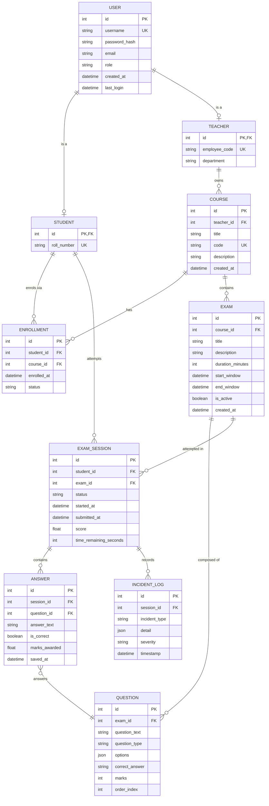
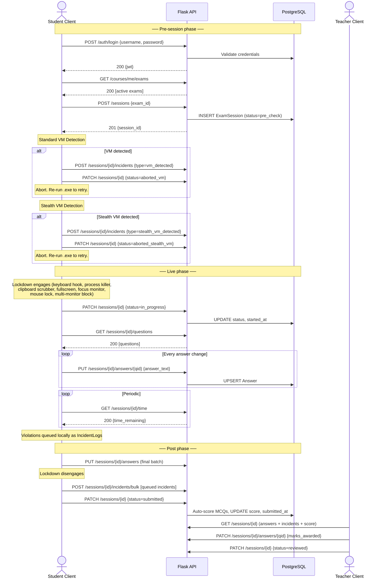

# ExamSentinel — Architecture Document

> **Status:** Pre-implementation specification
> **Audience:** Every contributor; read this before writing code.

---

## 1. System Topology

ExamSentinel is a two-tier system: a single Windows desktop client and a cloud-hosted REST API.

```
┌──────────────────┐         HTTPS/JSON           ┌─────────────────────────┐
│  Windows Client  │ ◄──────────────────────────► │  Flask API (Railway)    │
│  (Tkinter / .exe)│         JWT bearer           │  PostgreSQL (Railway)   │
└──────────────────┘                              └─────────────────────────┘
```

- **Server.** A Flask application using SQLAlchemy as ORM, deployed to Railway. Railway provisions and manages the PostgreSQL instance; the server connects via a `DATABASE_URL` environment variable injected at deploy time. The API is stateless — all session state lives in the database — so Railway can restart or redeploy the container without data loss.
- **Client.** A Tkinter desktop application, frozen into a single `.exe` with PyInstaller. It runs on Windows 10/11 machines used by students and teachers. Every interaction with the system flows through HTTPS calls to the server; there is no peer-to-peer traffic between clients.
- **Why this split?** The lockdown, VM-detection, and OS-hook features require native Windows access that a browser cannot provide. A desktop client gives unrestricted access to Win32 APIs while a cloud server centralises data, authentication, and grading without requiring the institution to operate infrastructure.

---

## 2. Domain Model

### 2.1 Entities

#### User
The root identity entity. Stores username, hashed password, email, role discriminator (`student` | `teacher`), and timestamps (created, last login). Every person in the system is a User first; role-specific data is held in the child entities below.

#### Student (extends User)
Adds `roll_number` (institution-issued identifier) and any student-specific profile fields. A Student enrols in Courses and sits Exams.

#### Teacher (extends User)
Adds `employee_code` and department. A Teacher owns Courses, authors Exams and Questions, and reviews completed ExamSessions.

#### Course
A logical container owned by exactly one Teacher. Attributes: `title`, `code` (e.g. `CS201`), `description`, `created_at`. Students are linked to a Course through Enrollment. A Course contains zero or more Exams.

#### Enrollment
Join entity between Student and Course. Attributes: `enrolled_at`, `status` (`active` | `dropped`). Enforces the many-to-many relationship and lets the system track when a student joined or left a course.

#### Exam
A timed assessment belonging to exactly one Course. Attributes: `title`, `description`, `duration_minutes`, `start_window`, `end_window` (the calendar interval in which the exam is accessible), `is_active` flag, `created_at`. An Exam is composed of one or more Questions.

#### Question
A single item on an Exam. Attributes: `question_text`, `question_type` (`mcq` | `short_answer`), `options` (JSON array, nullable — populated for MCQs), `correct_answer` (nullable — populated for MCQs to enable auto-grading), `marks`, `order_index`. Belongs to exactly one Exam.

#### ExamSession
Represents one student's single attempt at one exam. Attributes: `status` (see lifecycle states below), `started_at`, `submitted_at`, `score` (nullable, populated after grading), `time_remaining_seconds` (server-authoritative). Belongs to one Student and one Exam. An ExamSession owns Answers and IncidentLogs.

**Lifecycle states of ExamSession:**

| State | Meaning |
|---|---|
| `pre_check` | Session created; VM gates are running on the client. |
| `aborted_vm` | Standard VM detection fired; session cannot continue. |
| `aborted_stealth_vm` | Stealth VM detection fired; session cannot continue. |
| `in_progress` | Both VM gates passed; lockdown is active; student is answering. |
| `submitted` | Answers finalised, score computed (MCQs), incidents flushed. |
| `reviewed` | Teacher has completed manual review / grading. |

#### Answer
A student's response to a single question within a session. Attributes: `answer_text`, `is_correct` (nullable, set by auto-grading for MCQs), `marks_awarded` (nullable, set by teacher for short-answer), `saved_at`. Belongs to one ExamSession and one Question. Each answer is auto-saved as the student works; the latest value wins.

#### IncidentLog
An immutable forensic record attached to an ExamSession. Attributes: `incident_type` (enum: `vm_detected`, `stealth_vm_detected`, `focus_loss`, `blacklist_process_killed`, `clipboard_scrubbed`, `lockdown_violation`, `timing_anomaly`, `thermal_anomaly`), `detail` (JSON blob with specifics), `severity` (`info` | `warning` | `critical`), `timestamp`. Incidents are created on the client, queued locally, and flushed to the server at submission (or earlier when connectivity allows). The teacher reviews the full incident timeline during the review phase.

### 2.2 Primary Relationships

- **User ←1:0..1→ Student | Teacher** — single-table inheritance via role discriminator.
- **Teacher ←1:N→ Course** — a teacher owns many courses.
- **Course ←M:N→ Student** via **Enrollment** — many students in many courses.
- **Course ←1:N→ Exam** — a course contains many exams.
- **Exam ←1:N→ Question** — an exam is composed of ordered questions.
- **Student + Exam ←1:N→ ExamSession** — one session per attempt (retakes create new sessions).
- **ExamSession ←1:N→ Answer** — one answer per question per session.
- **ExamSession ←1:N→ IncidentLog** — zero or more incidents per session.

### 2.3 Entity-Relationship Description & Diagram

A User is the supertype; Student and Teacher inherit from it and carry role-specific attributes. A Teacher creates Courses. Students enrol in Courses via the Enrollment join table. Each Course holds Exams; each Exam holds Questions. When a Student starts an Exam, an ExamSession is created linking that Student to that Exam. Answers tie a session to a question. IncidentLogs belong to a session and are append-only.



---

## 3. Module Boundaries & Folder Layout

The repository has two top-level packages — `server/` and `client/` — plus `docs/` and a root `README.md`.

```
ExamSentinel/
├── docs/                         # Architecture docs, ADRs
│   └── ARCHITECTURE.md
├── server/
│   ├── app/
│   │   ├── models/               # SQLAlchemy model definitions
│   │   │   ├── user.py           # User, Student, Teacher
│   │   │   ├── course.py         # Course, Enrollment
│   │   │   ├── exam.py           # Exam, Question
│   │   │   └── session.py        # ExamSession, Answer, IncidentLog
│   │   ├── routes/               # Flask Blueprints — one per resource
│   │   │   ├── auth.py           # Login, registration, JWT issuance
│   │   │   ├── courses.py        # CRUD for courses and enrollments
│   │   │   ├── exams.py          # CRUD for exams and questions
│   │   │   └── sessions.py       # Session lifecycle, answers, incidents
│   │   ├── services/             # Business logic decoupled from HTTP
│   │   │   ├── auth_service.py   # Password hashing, JWT creation/validation
│   │   │   ├── exam_service.py   # Scoring, time enforcement
│   │   │   └── session_service.py# State machine transitions, incident ingestion
│   │   └── utils/                # Cross-cutting helpers
│   │       ├── config.py         # App configuration from env vars
│   │       ├── db.py             # SQLAlchemy engine/session setup
│   │       └── errors.py         # Unified error response formatting
│   ├── migrations/               # Alembic migration scripts
│   └── seed/                     # Development seed data scripts
├── client/
│   ├── app/
│   │   ├── services/             # Server communication layer
│   │   │   ├── api_client.py     # HTTP helper, JWT attach, retry logic
│   │   │   ├── auth_service.py   # Login flow, token storage
│   │   │   └── exam_service.py   # Fetch exams, submit answers, flush logs
│   │   ├── lockdown/             # Windows lockdown subsystem
│   │   │   ├── keyboard_hook.py  # Low-level keyboard hook (Win32)
│   │   │   ├── process_killer.py # Blacklist scanner and terminator
│   │   │   ├── clipboard.py      # Clipboard scrubber
│   │   │   ├── fullscreen.py     # Fullscreen takeover, taskbar hide
│   │   │   ├── focus_monitor.py  # Alt-tab / focus-loss detection
│   │   │   ├── mouse_lock.py     # Cursor boundary enforcement
│   │   │   └── multi_monitor.py  # Secondary display detection and block
│   │   ├── vm_detect/            # Pre-session VM gating
│   │   │   ├── standard.py       # Registry, MAC, BIOS, driver checks
│   │   │   └── stealth.py        # CPUID, RDTSC timing, evasion heuristics
│   │   └── ui/                   # Tkinter screens
│   │       ├── login.py          # Login screen
│   │       ├── dashboard.py      # Course & exam list
│   │       ├── exam_screen.py    # Live exam UI (questions, timer, submit)
│   │       └── result_screen.py  # Post-submission summary
│   ├── assets/                   # Icons, images, fonts
│   └── build/                    # PyInstaller spec and output
└── README.md                     # Project overview and quickstart
```

### Boundary rules

| Boundary | Allowed dependencies |
|---|---|
| `server/app/routes/` | May call `services/` and read `models/`; never touches OS or client code. |
| `server/app/services/` | May call `models/` and `utils/`; contains no HTTP/Flask imports. |
| `server/app/models/` | Pure SQLAlchemy; no business logic. |
| `client/app/ui/` | May call `services/` and `lockdown/` and `vm_detect/`; never imports server code. |
| `client/app/lockdown/` | Win32-only; no network calls. Exposes `engage()` / `disengage()` per module. |
| `client/app/vm_detect/` | Win32/ctypes only; returns pass/fail + detail dict. |
| `client/app/services/` | HTTP-only; wraps every server endpoint the client needs. |

---

## 4. Exam Session Lifecycle

The lifecycle has **three phases** executed in strict order. Re-running the `.exe` always restarts from step 1 — both VM gates run from scratch every time.

### 4.1 Numbered Prose

**Pre-session phase**

1. **Student logs in.** The client sends credentials to `POST /auth/login`. The server validates them and returns a JWT containing the user's `id`, `role`, and expiry. The client stores the token in memory.
2. **Student selects an active exam.** The client fetches the student's enrolled courses and their active exams (`GET /courses/me/exams`). The student picks one.
3. **Client creates an ExamSession.** `POST /sessions` with `exam_id`. The server creates a session with status `pre_check` and returns the session ID.
4. **Standard VM Detection runs.** The client executes `vm_detect/standard.py` — checks registry keys, MAC address prefixes, BIOS strings, and known hypervisor driver files. If any check is positive, the client ships an `IncidentLog` (`POST /sessions/{id}/incidents`) with type `vm_detected`, then sets session status to `aborted_vm` via `PATCH /sessions/{id}`. The exam screen is never shown. The student must close and re-run the `.exe` to try again (which re-runs both gates from scratch).
5. **Stealth VM Detection runs.** Only reached if step 4 passed. The client executes `vm_detect/stealth.py` — CPUID hypervisor-present bit, RDTSC timing deltas, thermal-sensor absence, and evasion heuristics (e.g. artificially inflated core counts). If positive, the client ships an incident with type `stealth_vm_detected`, sets session status to `aborted_stealth_vm`, and refuses to proceed. Same re-run rule applies.

**Live phase**

6. **Lockdown engages.** All lockdown modules activate in sequence: keyboard hook blocks restricted key combinations; process killer terminates blacklisted applications and begins periodic scanning; clipboard scrubber clears and monitors the clipboard; fullscreen takeover hides the taskbar and forces the exam window to cover all screen area; focus monitor watches for focus-loss events; mouse lock constrains the cursor to the exam window; multi-monitor block detects and disables secondary displays.
7. **Session transitions to `in_progress`.** The client confirms lockdown is engaged, then calls `PATCH /sessions/{id}` with status `in_progress`. The server records `started_at` and begins countdown based on `Exam.duration_minutes`.
8. **Student answers questions.** The client fetches questions (`GET /sessions/{id}/questions`) and renders them. Each answer is auto-saved to the server on change (`PUT /sessions/{id}/answers/{question_id}`). The client polls `GET /sessions/{id}/time` periodically to stay synchronised with the server-authoritative clock.
9. **Monitoring runs continuously.** Throughout the live phase, every lockdown module reports violations as they occur. Incidents are queued locally. Focus losses, process kills, clipboard scrubs, and any anomalies are logged with timestamps.

**Post phase**

10. **Submission.** Triggered manually by the student or automatically when the server reports time exhausted. The client finalises all pending answer saves.
11. **Lockdown disengages.** Each lockdown module is deactivated in reverse order, restoring the desktop to its original state.
12. **Incident flush.** All locally queued `IncidentLog` entries are bulk-shipped to the server (`POST /sessions/{id}/incidents/bulk`).
13. **Session marked `submitted`.** The client calls `PATCH /sessions/{id}` with status `submitted`. The server auto-scores MCQ answers (comparing `Answer.answer_text` against `Question.correct_answer`) and writes `ExamSession.score`.
14. **Teacher review.** The teacher opens a session in their dashboard. They see all answers, the computed MCQ score, and the full incident timeline. They assign marks to short-answer questions, can adjust the score, and transition the session to `reviewed`.

### 4.2 Sequence Diagram



---

## 5. Deployment Topology

```
┌─────────────────────────────────────────────────────────────────────┐
│                        Railway Platform                             │
│                                                                     │
│   ┌───────────────────┐        DATABASE_URL       ┌──────────────┐ │
│   │  Flask Container   │◄────────────────────────►│  PostgreSQL   │ │
│   │  (Gunicorn/uWSGI)  │                          │  (managed)    │ │
│   │  Port exposed via   │                          └──────────────┘ │
│   │  Railway proxy      │                                           │
│   └────────┬────────────┘                                           │
│            │ HTTPS (Railway-issued domain or custom domain)         │
└────────────┼────────────────────────────────────────────────────────┘
             │
        Public Internet
             │
     ┌───────┴────────┐
     │ Windows Client  │
     │ (.exe, any      │
     │  Win 10/11 PC)  │
     └────────────────┘
```

- **HTTPS everywhere.** Railway terminates TLS at its proxy. The client pins the API base URL (e.g. `https://examsentinel.up.railway.app`) and sends all requests with the JWT in the `Authorization: Bearer` header.
- **No inbound connections to the client.** The client is always the initiator; no ports need to be opened on student/teacher machines.
- **Database access.** Only the Flask container can reach PostgreSQL; the database is not exposed to the public internet. Railway manages backups and connection pooling.
- **Stateless server.** No local file storage or in-memory session state. Any Railway container restart is transparent to clients (in-flight requests may retry).

---

## 6. Technology Rationale

### Why Flask?
Flask is lightweight, well-understood, and sufficient for a REST API of this scope. It avoids the ceremony of larger frameworks while providing the extension ecosystem (Flask-JWT-Extended, Flask-Migrate) needed for auth and schema evolution. The team can reason about every line of request handling.

### Why SQLAlchemy?
SQLAlchemy provides a mature ORM with explicit control over queries, migrations (via Alembic), and relationship loading. It maps cleanly to the domain model's inheritance (User → Student/Teacher) and supports PostgreSQL-specific types (JSONB for incident details and question options).

### Why PostgreSQL?
PostgreSQL handles the relational model (enrolments, session-question-answer joins) naturally, supports JSONB columns for semi-structured data (incident details, MCQ options), and is the default managed database on Railway with zero-configuration provisioning.

### Why Tkinter?
Tkinter ships with CPython — no additional GUI dependency to install or bundle. For a form-driven exam UI with a timer and question navigation, Tkinter is adequate and keeps the PyInstaller bundle small. The lockdown layer operates below the GUI toolkit via ctypes/Win32 calls, so the choice of GUI framework is independent of the security surface.

### Why PyInstaller single-file?
A single `.exe` simplifies distribution to exam centres. There is no installer, no runtime to pre-install, and no PATH configuration. The student downloads one file, double-clicks, and the VM gates begin. Single-file mode also prevents casual inspection of bundled Python source.

### Why JWT?
JWTs allow the server to remain stateless — no server-side session store is needed. The token carries the user's role, enabling the client to adapt its UI (student dashboard vs. teacher dashboard) immediately after login. Token expiry limits the window of a stolen credential. Refresh tokens are not used; exam sessions are short-lived enough that a single access token with a reasonable TTL suffices.

### Why Railway?
Railway offers one-click PostgreSQL provisioning, automatic HTTPS, environment-variable injection, and container-based deploys from a Git push. It eliminates the need for the team to manage TLS certificates, reverse proxies, or database backups during the project's academic lifecycle.
